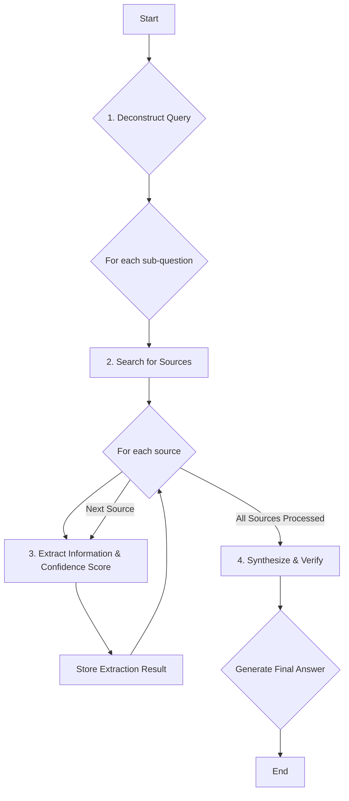

# Robust Fact-Checking and Grounding System

This document outlines the architecture and workflow for a robust, multi-step fact-checking and grounding system using the Google Gemini GenAI API. The goal is to enhance the reliability and depth of the research performed by the application, moving from a single-shot extraction to an iterative verification process.

## System Overview

The proposed system implements a multi-step fact-checking loop. Instead of relying on a single API call to find and extract information, the system breaks down the research process into a series of smaller, more focused steps. This approach allows for greater accuracy, better source validation, and a more robust confidence scoring mechanism.

## Flow Diagram

## Detailed Steps

### 1. Deconstruct Query

The first step is to break down the user's main query into a series of smaller, verifiable questions. This can be done by using the Gemini model with a prompt designed for this purpose.

**Example:**

*   **User Query:** "Compare the tuition and program length for an MBA at Harvard and Stanford."
*   **Sub-questions:**
    *   "What is the tuition for the MBA program at Harvard Business School?"
    *   "What is the program length for the MBA program at Harvard Business School?"
    *   "What is the tuition for the MBA program at Stanford Graduate School of Business?"
    *   "What is the program length for the MBA program at Stanford Graduate School of Business?"

### 2. Search for Sources

For each sub-question, use the `googleSearch` tool in the Gemini API to find a diverse set of high-quality sources. The prompt should be engineered to prioritize official sources, such as university websites, and to return multiple URLs.

### 3. Extract Information & Confidence Score

For each source URL returned by the search, make a separate call to the Gemini API to extract the specific piece of information required. The prompt should instruct the model to:

*   Extract the answer to the sub-question.
*   Provide a confidence score (e.g., "High", "Medium", "Low").
*   Justify the confidence score based on the clarity and authority of the source.

### 4. Synthesize and Verify

After extracting information from all sources, the system will synthesize the results. This involves:

*   **Cross-referencing:** Compare the answers from different sources. If the answers are consistent, the confidence in the final answer increases.
*   **Conflict Resolution:** If there are conflicting answers, the system can either flag the discrepancy to the user or attempt to resolve it by prioritizing the most reliable sources.
*   **Generating a Final Answer:** Once the information is verified, the system generates a final, consolidated answer to the user's original query.

## Enhanced Confidence Scoring

The confidence score will no longer be based on simple heuristics. Instead, it will be a composite score derived from:

*   The model's self-assessed confidence for each extraction.
*   The number of corroborating sources.
*   The perceived authority of the sources (e.g., `.edu` domains are given more weight).

## User Transparency

To maintain user trust, the system will provide a transparent view of its research process:

*   **Cite Sources:** All information will be accompanied by links to the sources from which it was extracted.
*   **Show Confidence:** The confidence level for each piece of information will be clearly displayed.
*   **Explain Discrepancies:** If there are conflicting pieces of information that cannot be resolved, they will be presented to the user with a clear explanation.

## Achieving "Deep Search"

This multi-step, iterative process is how the system achieves a "deep search." By breaking down the problem, exploring multiple sources, and cross-verifying information, the system provides a more thorough and reliable research outcome than a single-shot query. This approach mimics the process a human researcher would follow, leading to more accurate and trustworthy results.

---

## Comparison: Current vs. Proposed System

The proposed multi-step system represents a fundamental shift from the current single-step flow. It moves from a "trust-but-verify" model to an explicit, orchestrated "verify-then-trust" workflow.

Here is a detailed comparison of the key differences:

| Aspect | Current System (Single-Step Flow) | Proposed System (Multi-Step Flow) |
| :--- | :--- | :--- |
| **Core Logic** | A single, complex prompt asks Gemini to perform all tasks (search, extract, validate, format) in one go. | A sequence of simpler, focused prompts guides the model through distinct stages: **1. Deconstruct**, **2. Search**, **3. Extract**, **4. Synthesize**. |
| **Execution Flow**| **Linear & Atomic:** The process is a single API call from the client. `User -> Frontend -> Gemini API -> Response`. | **Iterative & Looping:** The process is a managed workflow. `User -> Backend -> (Loop: Deconstruct -> Search -> Extract -> ...) -> Synthesize -> Response`. |
| **Control over Search**| **Implicit:** Relies entirely on Gemini's internal logic to generate and execute search queries. We have no direct control. | **Explicit:** The system can generate its own sub-questions and execute targeted searches for each one, allowing for more granular and deeper investigation. |
| **Verification & Fact-Checking**| **Post-Hoc:** Verification is limited to checking the `groundingMetadata` after the answer is generated. It assumes the AI did a good job of cross-referencing internally. | **In-Process & Proactive:** The system actively performs verification by extracting data from **multiple sources individually** and then comparing them in the "Synthesize & Verify" step. It doesn't just trust the initial output. |
| **Confidence Scoring**| **Heuristic-based:** A simple score is derived from the completeness of the final extracted data (e.g., if `total_credits` is present). | **Evidence-based:** A more robust score is calculated based on the number of corroborating sources, the model's self-assessed confidence for each extraction, and the authority of the sources. |
| **System Architecture**| **Client-Side:** The logic resides entirely on the frontend (`geminiService.ts`). | **Backend-Centric:** The multi-step orchestration is best managed on a server, which handles the stateful, iterative process, making it more robust and scalable. |
| **"Deep Search" Capability**| **Shallow:** It's a "quick search." The depth is limited to what the model decides to do in a single turn. | **Deep:** This workflow **is** the "deep search." By breaking down the problem and iteratively digging for answers, it mimics a human research process, resulting in a more thorough and reliable investigation. |

In summary, the current logic is like asking an assistant to write a report and just trusting the final output. The proposed logic is like asking the assistant to first find all the sources, then show you the key points from each source, and only then write the final report based on the verified points.

This new approach provides **greater control, explicit verification, and higher confidence** in the final result, directly addressing the goal of creating a more robust fact-checking application.

---

## Proposed Code Modifications

To implement the robust fact-checking system, the core logic will be moved from the client-side to the backend. This involves creating a new orchestration service on the server and adapting the frontend to communicate with it.

### Backend Modifications (New Logic)

The primary changes will be within the `server` directory.

1.  **File: `server/routes/gemini.js`**
    *   **Action:** Add a new route to handle deep extraction requests.
    *   **Details:**
        *   Create a new POST endpoint, e.g., `/api/gemini/deep-extract`.
        *   This endpoint will receive the `school` and `program` from the frontend.
        *   It will invoke a new `deepExtractionService` to perform the multi-step fact-checking loop.
        *   Since this will be a long-running process, consider using WebSockets or Server-Sent Events (SSE) to stream updates back to the client (e.g., "Step 1/4: Deconstructing query...").

2.  **File: `server/services/deepExtractionService.js` (New File)**
    *   **Action:** Create a new file to house the orchestration logic for the multi-step process.
    *   **Details:** This service will export a main function (e.g., `performDeepExtraction`) that:
        *   **Receives** the initial query (`school`, `program`).
        *   **Step 1 (Deconstruct):** Calls the Gemini API with a prompt to break the main query into sub-questions.
        *   **Step 2 (Search):** For each sub-question, calls the Gemini API with the `googleSearch` tool to get a list of source URLs.
        *   **Step 3 (Extract):** For each source URL, calls the Gemini API to extract the specific information and a confidence score.
        *   **Step 4 (Synthesize):** Compiles all the extracted information, cross-references the data, resolves conflicts, and calculates a final, evidence-based confidence score.
        *   **Returns** the final, verified result.

### Frontend Modifications (Adapting the UI)

The frontend will be simplified, as it will no longer contain the core business logic.

1.  **File: `services/geminiService.ts`**
    *   **Action:** Modify the `simulateExtraction` function or create a new one.
    *   **Details:**
        *   The existing `simulateExtraction` function, which contains the client-side Gemini API call, will be deprecated or removed.
        *   A new function, e.g., `performDeepExtraction(school, program)`, will be created.
        *   This new function will **not** call the Gemini API directly. Instead, it will make a `fetch` request to the new backend endpoint: `POST /api/gemini/deep-extract`.
        *   It will handle the response from the backend, which will contain the final, verified data. If using SSE, this service will manage the event stream.

2.  **File: `pages/ProjectDetail.tsx`**
    *   **Action:** Update the component to call the new service and handle the new data structure.
    *   **Details:**
        *   The `handleRunExtraction` function will now call `performDeepExtraction` from `geminiService.ts`.
        *   The UI will need to be updated to handle the asynchronous, multi-step nature of the backend process. This might involve displaying progress updates to the user.
        *   The component will be updated to display the richer data returned from the backend, including the evidence-based confidence score and detailed source information.

### Environment & Configuration Changes

1.  **`server/.env.example` & `server/.env`**
    *   **Action:** The `GEMINI_API_KEY` must be moved from the frontend to the backend.
    *   **Details:** Add `GEMINI_API_KEY=` to the server's environment file. The server will now be responsible for authenticating with the Gemini API.

2.  **`.env.local` (Frontend)**
    *   **Action:** The `VITE_API_KEY` (or `GEMINI_API_KEY`) can be removed from the frontend environment file, as the frontend no longer needs direct access to the API key. This improves security.
