# Agentic Extraction Architecture

This document provides visual diagrams of the Academic-Insights agentic extraction system using Mermaid.

As of Tuesday Dec 16 2025

## System Overview

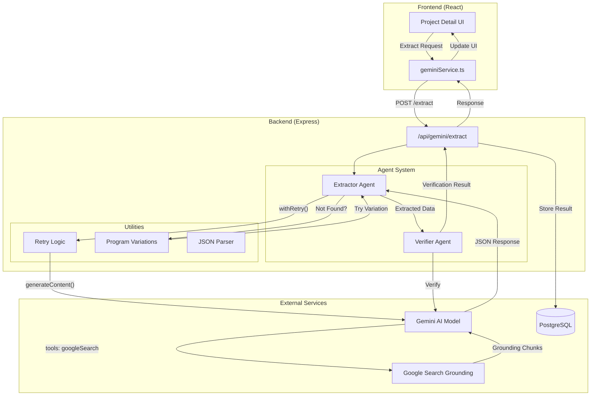

## Extraction Flow (Detailed)

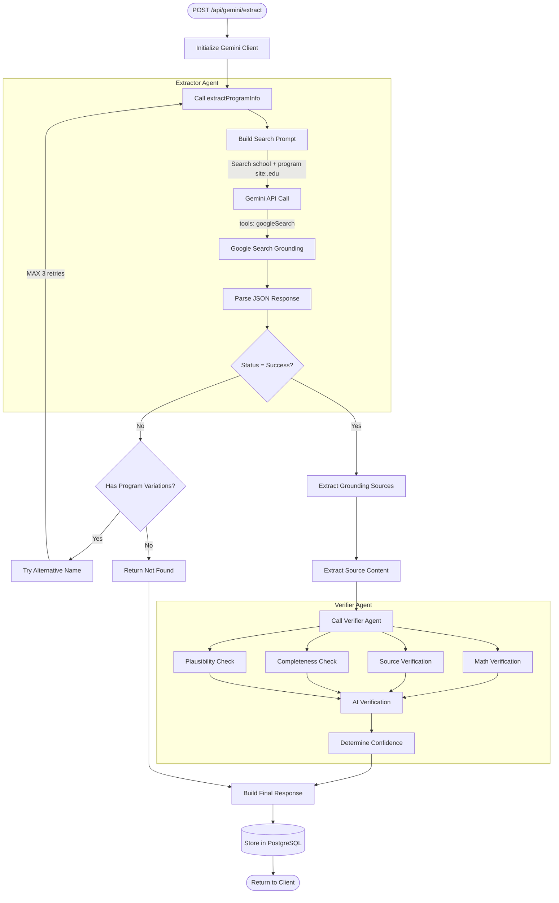

## Retry Logic with Exponential Backoff

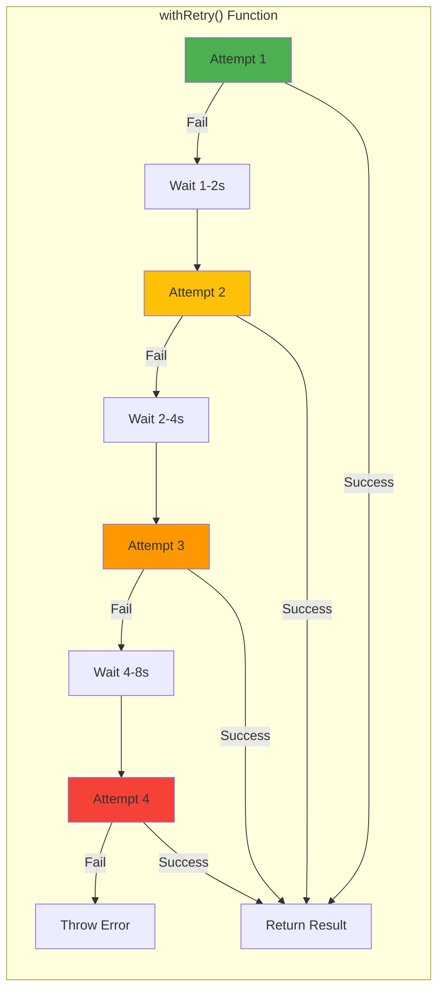

## Program Variation Retry Strategy

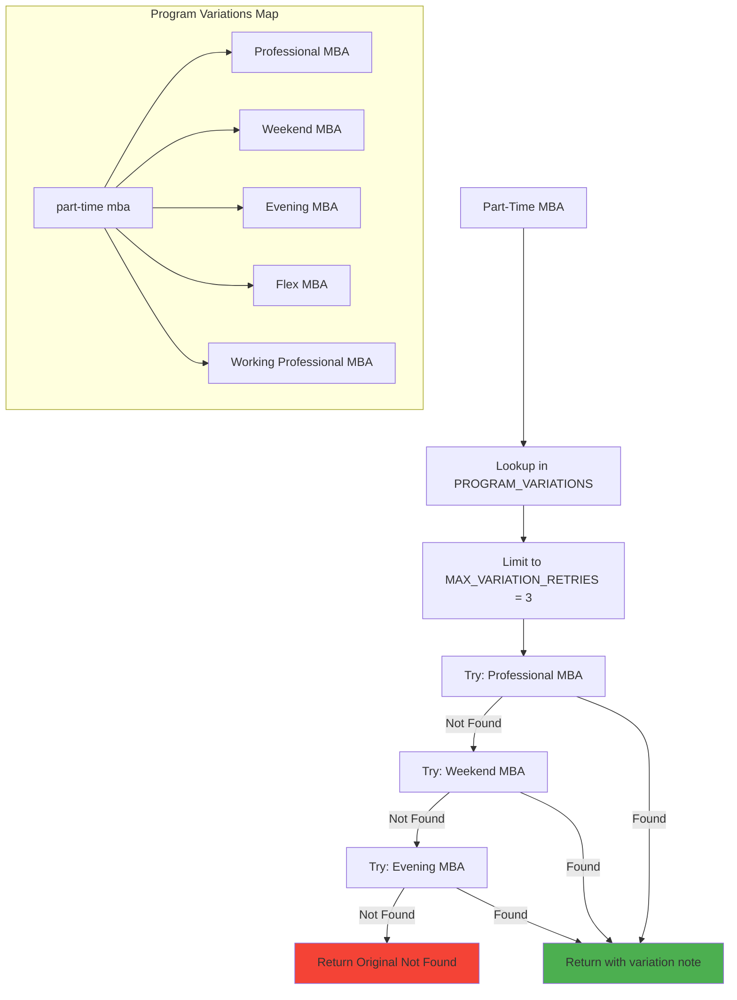

## Verifier Agent - Rule-Based Checks

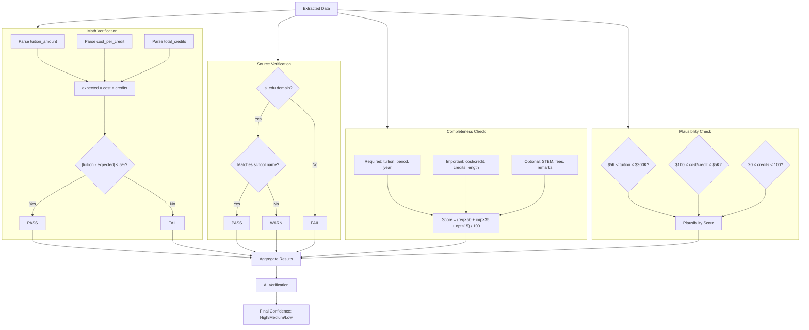

## AI Verification Flow

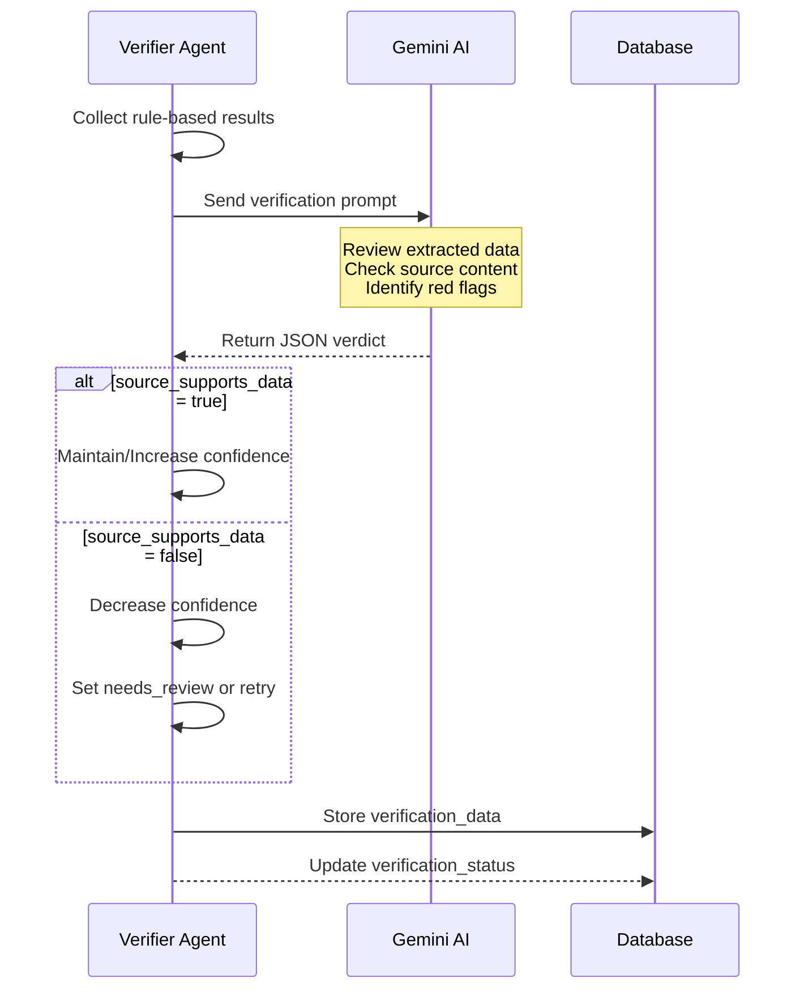

## Data Flow Through System

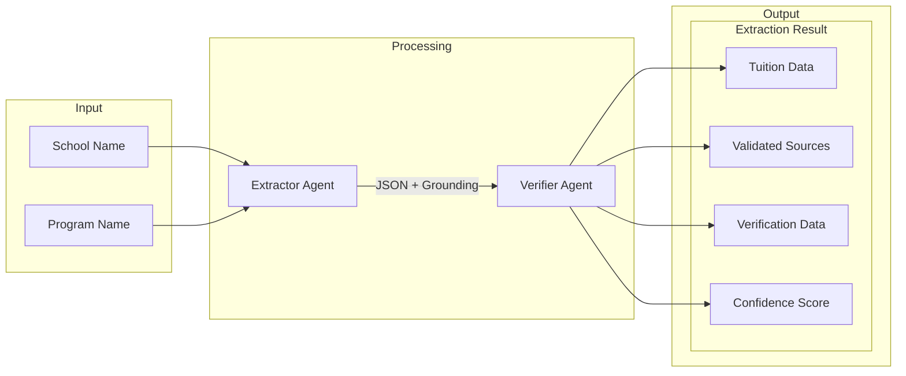

## Confidence Score Determination

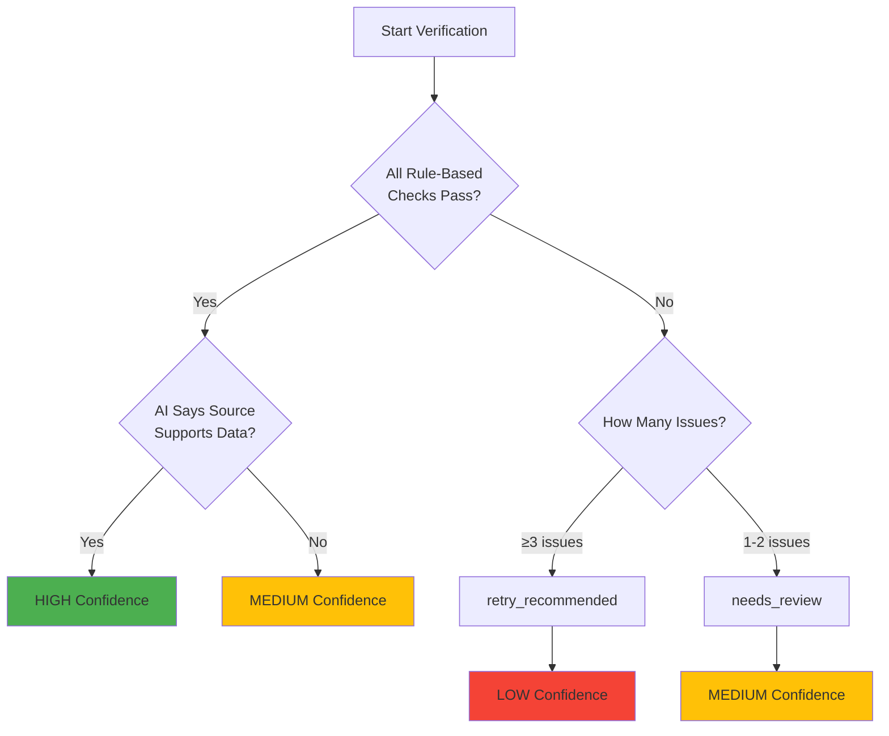

## Database Schema (Verification Fields)

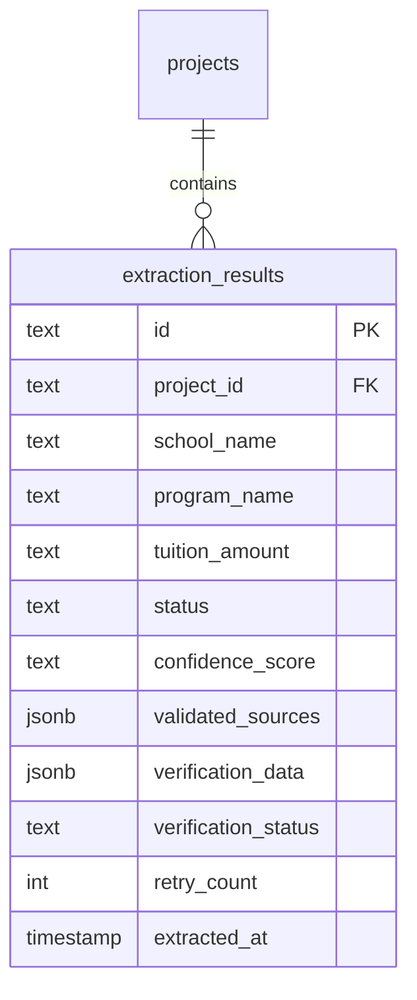

## Component Dependencies

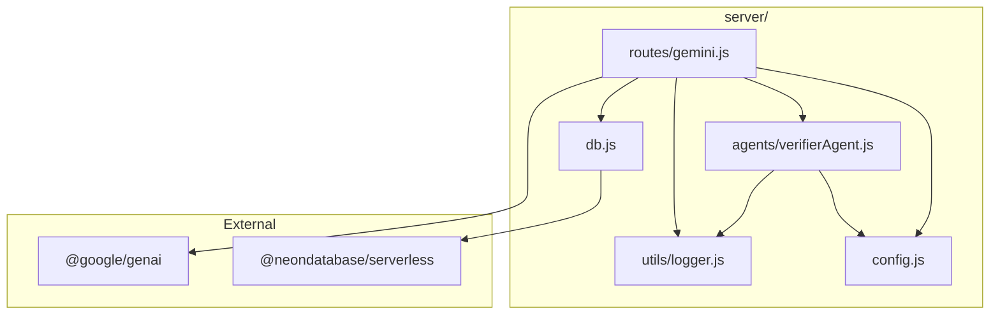

## Error Handling Flow

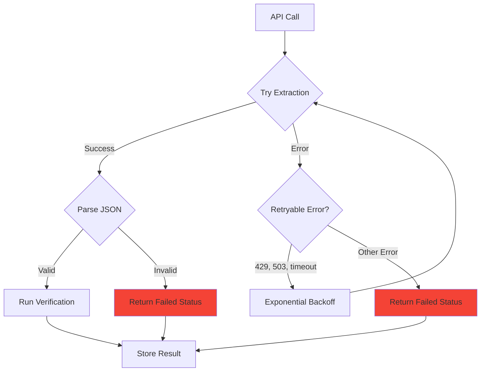

## Summary Statistics

| Component | Purpose | Key Functions |
|-----------|---------|---------------|
| **Extractor Agent** | Extract tuition data from web | `extractProgramInfo()` |
| **Verifier Agent** | Validate extraction accuracy | `verifyExtraction()` |
| **Retry Logic** | Handle transient failures | `withRetry()` |
| **Program Variations** | Alternative name lookup | `getProgramVariations()` |
| **AI Verification** | Intelligent data validation | `performAIVerification()` |

## Configuration Constants

| Constant | Value | Purpose |
|----------|-------|---------|
| `MAX_VARIATION_RETRIES` | 3 | Limit program name retry attempts |
| `RETRY_CONFIG.maxRetries` | 3 | Max API call retries |
| `RETRY_CONFIG.baseDelayMs` | 1000 | Initial backoff delay |
| `RETRY_CONFIG.maxDelayMs` | 10000 | Maximum backoff delay |

---

*Last Updated: December 16, 2025*
*Version: Phase 2 - Verification Agent Complete*
